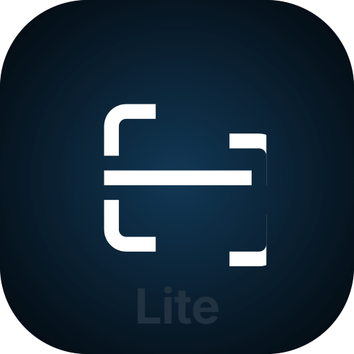

  

# README LITE For Windows
## Description
specialized Markdown workspace for building high‑quality README.md

> readme lite is just 60mb 

## Features
- Upload to github use token api 
- drawing tools
- scan folder | image/strucure
- Import from GitHub
- Quick Setup Wizard
- translate
- watch score 
- add new tab 
- cntr+F Find
- Map in editor 
- Editor & Live Preview
- and more

## `Screenshots`

| |  |
|---|---|
|  |  |

#`git upload and draw tool`
|  |  |
|---|---|
|  |  |
#`Theme`
|  |  |
|---|---|
|  |  |
|  |  |

#`Video`

# Keyboard shortcuts
| Key | key |
| :--- | :--- |
| cntr+t | new tab |
| cntr+w | close tab |
| cntr+s | save |

# Keyboard shortcut Draw

| key | key |
| :--- | :--- |
| V | select |
| R | rect |
| E | Circle |
| L | Line |
| A | Arrow |
| P | Pen |
| T | Text |

### Download Now [README](https://github.com/YASSER-27/Readme_Lite/releases/download/1.0.0/Readme.Lite.exe)

### Author
**YASSER-27** - [GitHub](https://github.com/YASSER-27/) 

